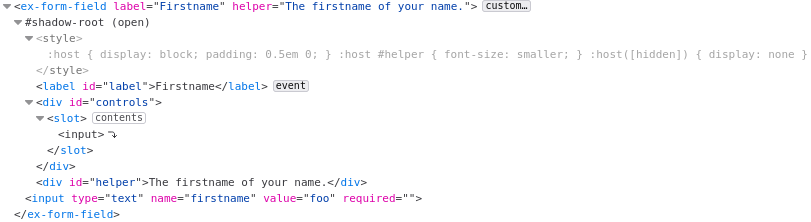

# ex-form-field

_The source code of the implementation and, the test of this example are available in the Git repository of `<ceb/>` : `examples/ex-form-field`._

This example demonstrates how to leverage on some builders and decorators to create a custom element able to wrap form elements with a label and, a helper text.
Both fields can be accessed and mutated with the respective attributes and properties.
Additionally, when the user clicks on the label element, the focus is dynamically propagated to the first focusable wrapper elements.

For instance the following snippet wrap an input text with the label `Firstname` and the helper text `The firstname of your name.` :

```html
<ex-form-field label="Firstname" helper="The firstname of your name.">
    <input type="text" name="firstname" value="foo" required="" />
</ex-form-field>
```

With Mozilla Firefox, the initial Flatten DOM related to the Custom Element looks like :



The Custom Element `ex-form-field` involves the following native `<ceb/>` builders :

|Builders|Comment|
|---|---|
|`ElementBuilder`|The builder registers the Custom Element.|
|`ContentBuilder`|The builder is used as a decorator and define the content of the Custom Element's Shadow DOM at its creation.|
|`FieldBuilder`|The builder is used as a decorator to define the two Custom Element's API items: the label and the helper text.|
|`AttributePropagationBuilder`|The builder is used as a decorator to delegate the mutations of the API items (i.e. the label and the helper text) to the respective DOM elements.|
|`OnBuilder` and `ReferenceBuilder`|Both builders are used to react on click event on the label element in order to delegate the focus to the first focusable wrapped form control.|
