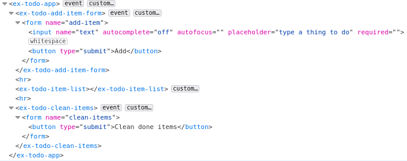

# ex-todo

_The source code of the implementation and, the test of this example are available in the Git repository of `<ceb/>` : `examples/ex-todo`._

This example demonstrates how to implement an application managing a simple list of todo item with Custom Element and the native `<ceb/>` builders

|Custom Element|Comment|
|---|---|
|`ex-todo-app`|Displays the application and handles the commands `ex-todo-add-item` and `ex-todo-clean-items`|
|`ex-todo-add-item-form`|Displays a form to submit items. On submissions the Custom Event `ex-todo-add-item` is dispatched.|
|`ex-todo-clean-items`|Displays a form to trigger the cleaning of completed items. On submissions the Custom Event `ex-todo-clean-items` is dispatched.|
|`ex-todo-item-list`|Displays a list of `ex-todo-item`|
|`ex-todo-item`|Displays a form to mutate the content and status of an item.|

For instance the following snippet instantiates the application :

```html
<ex-todo-app></ex-todo-app>
```

Right after its instanciation, the initial Flatten DOM looks like :



After the creation of two items where one is flagged as "completed", then the application looks like :


And the respective Flatten DOM looks like :


