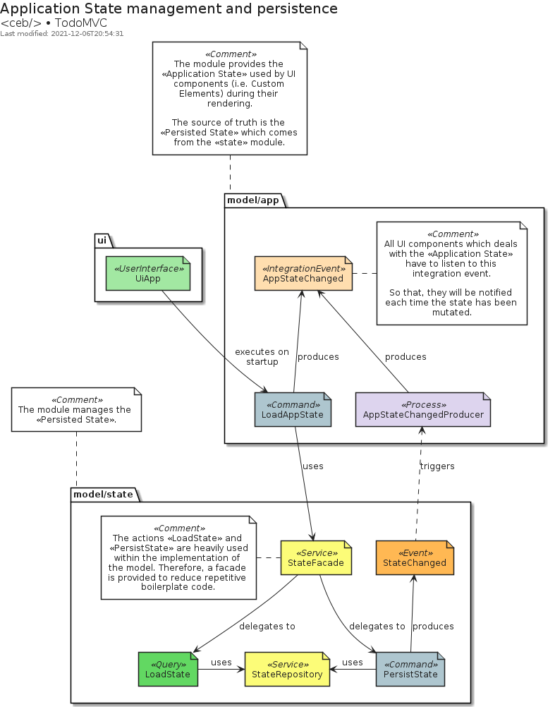
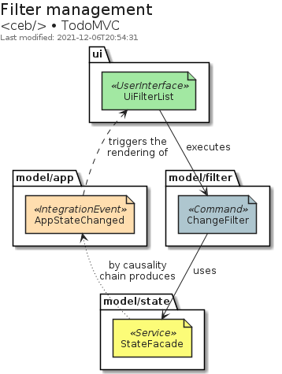
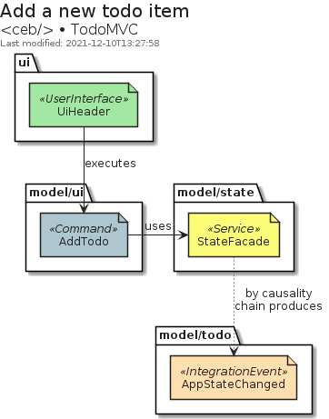
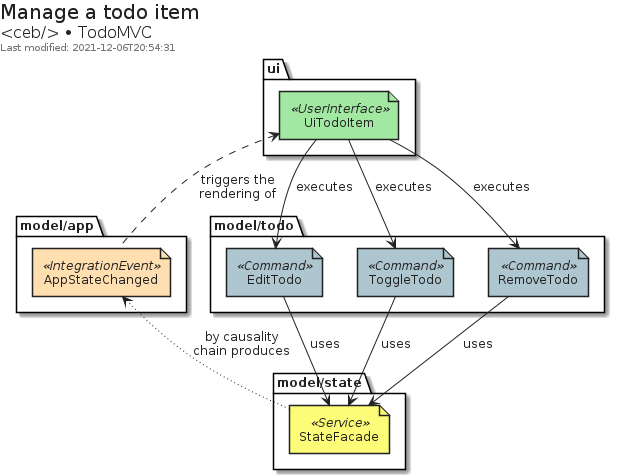
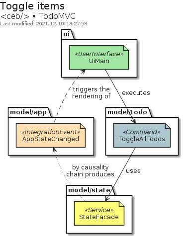

# TodoMVC

This example is an implementation of the [TodoMVC](https://todomvc.com) application with `<ceb/>`.

<iframe src="https://codesandbox.io/embed/ceb-example-todomvc-l66ys?fontsize=14&hidenavigation=1&theme=light&view=preview"
style="width:100%; height:500px; border:0; border-radius: 4px; overflow:hidden;"
title="&lt;ceb/&gt; ~ example - TodoMVC"
allow="accelerometer; ambient-light-sensor; camera; encrypted-media; geolocation; gyroscope; hid; microphone; midi; payment; usb; vr; xr-spatial-tracking"
sandbox="allow-forms allow-modals allow-popups allow-presentation allow-same-origin allow-scripts"></iframe>

## Introduction

The implementation embraces a kind of [Hexagonal Architecture] to provide a loose coupling integration between: the UI, the application logic (i.e. the model) and, the adapters (i.e. the persistence system ...).
The communication between both concerns the UI and the application logic is managed by a [Message/Event Driven approach] which emphasizes the [CQRS pattern].

[hexagonal architecture]: https://alistair.cockburn.us/hexagonal-architecture
[message/event driven approach]: https://www.reactivemanifesto.org/glossary#Message-Driven
[cqrs pattern]: https://www.martinfowler.com/bliki/CQRS.html

## Codebase

The codebase is composed of three main modules.

The module `ui` implements the user interface.
Its implementation focuses only on the user interactions delegating to the module `model` the management of the _application state_.

The module `model` implements the business logic following the [CQRS pattern].
Its purpose is to handle the commands and queries coming from the UI in order to mutate, persist and then share the new _application state_.

Finally, The module `infrastructure` provides the adapters which implement the ports provided by the model.
Basically, the persistence system used to store the _application state_.

## Application state

The _application state_ is a data structure used by UI components.
The `model/app` module produces and shares it as an _integration event_.
The data comes from the `model/state` module which is responsible to persist and load the values.

## Filter management

The Custom Element `UiFilterList` manages the filter selection with the fragment identifier of the URL displayed a regular HTML anchor elements, i.e. `<a/>`.
Therefore, on the [haschange] event, the command `ChangeFilter` is executed with the wished filter.
Because of the causality chain, the integration event `AppStateChanged` will be published with the wished filter.
So that, `UiFilterList`can highlight the current filter.

[haschange]: https://developer.mozilla.org/en-US/docs/Web/API/Window/hashchange_event

## Add a new todo item

The Custom Element `UiHeader` displays the form to enter a new todo.
On its submission, the command cAddTodo` is executed.
Because of the causality chain, the integration event `AppStateChanged` will be published with the new item.

## Manage a todo item

The Custom Element `UiTodoItem` displays the item content as well as UI artifacts to manage it.
According to the user interactions, the following commands can be executed: `EditTodo`, `ToggleTodo` and `RemoveTodo`.
Because of the causality chain, the integration event `AppStateChanged` will be published with underlying changes.

The Custom Element `UiMain` displays a checkbox which toggle the state of the items.
When the state of the checkbox changes, the command `ToggleAllTodos` is executed.
Because of the causality chain, the integration event `AppStateChanged` will be published with the updated items.

