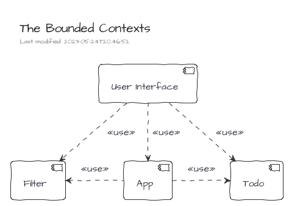
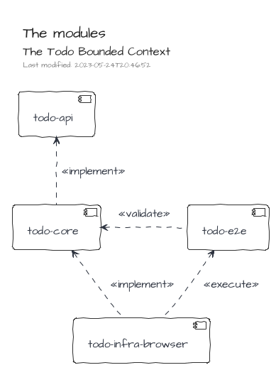
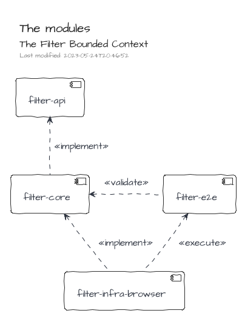
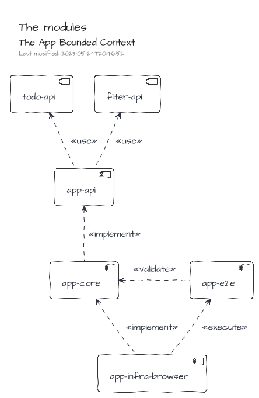
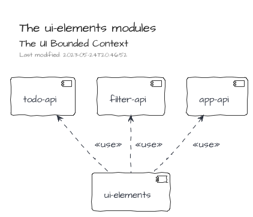
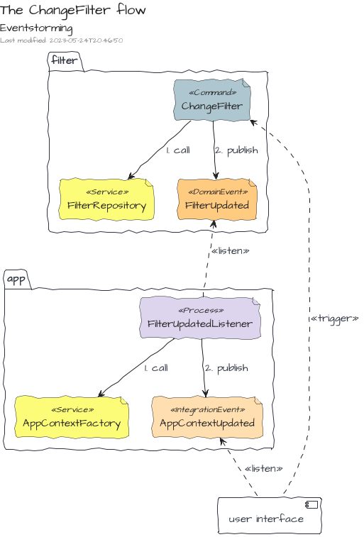

# TodoMVC

This example is an implementation of the [TodoMVC](https://todomvc.com) application with `<ceb/>`.

<iframe src="https://codesandbox.io/embed/ceb-example-todomvc-fzll0?fontsize=14&hidenavigation=1&theme=light&view=preview"
style="width:100%; height:500px; border:0; border-radius: 4px; overflow:hidden;"
title="&lt;ceb/&gt; ~ example - TodoMVC"
allow="accelerometer; ambient-light-sensor; camera; encrypted-media; geolocation; gyroscope; hid; microphone; midi; payment; usb; vr; xr-spatial-tracking"
sandbox="allow-forms allow-modals allow-popups allow-presentation allow-same-origin allow-scripts"></iframe>

## Introduction

The implementation embraces a kind of [Hexagonal Architecture] to provide a loose coupling integration between: the UI, the application logic (i.e. the model) and, the adapters (i.e. the persistence system ...).
The communication between both concerns the UI and the application logic is managed by a [Message/Event Driven approach] which emphasizes the [CQRS pattern].

[hexagonal architecture]: https://alistair.cockburn.us/hexagonal-architecture
[message/event driven approach]: https://www.reactivemanifesto.org/glossary#Message-Driven
[cqrs pattern]: https://www.martinfowler.com/bliki/CQRS.html

## Codebase

The codebase is composed of four Bounded Contexts organized in modules.

### The Bounded Contexts

| Name           | Description                       |
|----------------|-----------------------------------|
| Todo           | Manage the todos of the list.     |
| Filter         | Manage the filtering of the list. |
| App            | Manage the application lifecycle. |
| User Interface | Manage the User Interface.        |

### The Module Types

The modules are qualified by _types_.
The purpose of the _types_ is to organize the source code according to the [Hexagonal Architecture].

Each bounded context may have modules of the following types: _core_, _api_, _infra_, _ui_ and _e2e_.

The _core_ modules contain the implementation of the Bounded Context's functionalities.
They contain also the _ports_ as defined by the Hexagonal Architecture.

The _api_ modules provides resources to interact with the Bounded Context's functionalities.
They are mainly composed of message definitions (commands, events, queries and results) and other data structures.

The _infra_ modules contain the implementations of _ports_ defined in the _core_ modules, i.e. _adapters_ as defined by the Hexagonal Architecture.

The _ui_ modules contain resources handling the interactions with humans.

Finally, the _e2e_ (i.e. end-to-end ) modules contain test suites which can be used by _infra_ modules to validate the implementation of _ports_ coming from _core_ modules.

## Todo 

This bounded context manages the _todos_ which composes the todo list.

## Filter

This bounded context manages the _filtering_ of the todo list.

## App

This bounded context manages the _application_ lifecycle.
The main purpose of the Bounded Context is to produce and publish the application state.

## User Interface

This bounded context manages the user interactions.

It is composed of two exclusive modules, `ui-elements` and `ui-frp`.

The first one provides an implementation based on Custom Elements and leveraging on the `<ceb/>` library exclusively.

The second one provides a Functional Reactive Programing implementation which leverages on `RxJS` for the _functional domain_ and `lit-html` for the rendering side.

## Collaboration between Bounded Contexts

### AddTodo

The command AddTodo adds a new Todo to the todo list.
The command is triggered by the User Interface then once the causality chain is done, the Integration Event TodosUpdated is published.
Therefore, the UI can react.

The flow is similar for the ChangeFilter command.

