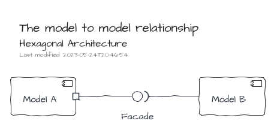
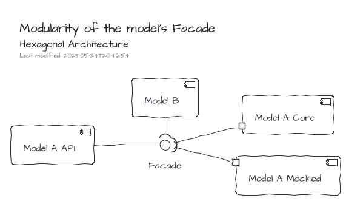

# Hexagonal Architecture

Despite both following facts, the IoC container can be applied to other architecture styles and the Hexagonal Architecture can be implemented without IoC, at the end, IoC and Hexagonal Architecture just work well together :).

This architecture helps to refine a model to separate the functional to the technical.
The technical concern is pushed to the boundary of the _model_ within contracts (i.e. interfaces), identified as _ports_.
The contacts are implemented within the _infrastructure_ by _adapters_

Obviously, a _port_ can be satisfied by many _adapters_.
Therefore, it becomes easy to configure a _setup_ by execution contexts: development, integration testing, functional testing, production ...

The relationship between two _models_ can be handled with a regular Facade.

However, the relationship can be handled using the port/adapter approach.
The introduction of a component which expose only the API of a model leads to definition of contextual adapters.
For instance, the component API can be satisfied by an adapter dedicated for testing purpose which is just a _mock_ of the core implementation.

