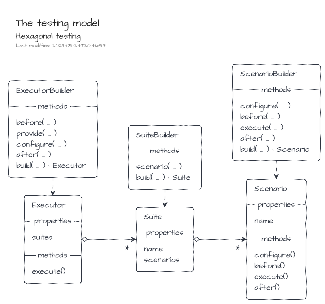

# Hexagonal testing

> The testing model is bundled in the NPM package [@tmorin/ceb-inversion-testing-core](https://www.npmjs.com/package/@tmorin/ceb-inversion-testing-core).

The isolation, provided by the Hexagonal Architecture, makes the testing of models easier.
However, it leads to an annoying side effect: some tests, especially the functional ones, are duplicated among the adapters.

`<ceb/>` provides a testing library to prevent test duplication.
The purpose is to define tests in the _model_ which have to be executed in the _adapters_.
So that, an _adapter_ can validate the _port_ implementation satisfy the _model_.
The library leverages on the IoC container to let the _adapter_ binds its implementation to the _port_.



From the _model_ point of view, i.e. the supplier, the suites are created using the TestSuiteBuilder and the scenarios with the TestScenarioBuilder.

```typescript
{{#include ../../packages/ceb-book-samples/src/inversion/hexagonal_testing-suite.ts}}
```

## Mocha Implementation

> The Mocha implementation of the testing model is bundled in the NPM package [@tmorin/ceb-inversion-testing-mocha](https://www.npmjs.com/package/@tmorin/ceb-inversion-testing-mocha).

An implementation of the testing model is provided for Mocha.

From the provider point of view, the suites are executed using the MochaTestSuiteExecutorBuilder.

```typescript
{{#include ../../packages/ceb-book-samples/src/inversion/hexagonal_testing-mocha.ts}}
```

## Jest Implementation

> The Jest implementation of the testing model is bundled in the NPM package [@tmorin/ceb-inversion-testing-jest](https://www.npmjs.com/package/@tmorin/ceb-inversion-testing-jest).

An implementation of the testing model is provided for Jest.

From the provider point of view, the suites are executed using the JestTestSuiteExecutorBuilder.

```typescript
import { JestTestSuiteExecutorBuilder } from "@tmorin/ceb-inversion-testing-jest"
import { OnlyConfigureModule } from "@tmorin/ceb-inversion-core"
import { SuiteA } from "./hexagonal_testing-suite"

describe("ToEmphasize Adapter", function () {
  JestTestSuiteExecutorBuilder.get(SuiteA)
    .configure((containerBuilder) => {
      containerBuilder.module(
        OnlyConfigureModule.create(async function () {
          this.registry.registerValue("ToEmphasize", (value: string) =>
            value.toUpperCase()
          )
        })
      )
    })
    .build()
    .execute()
})
```
