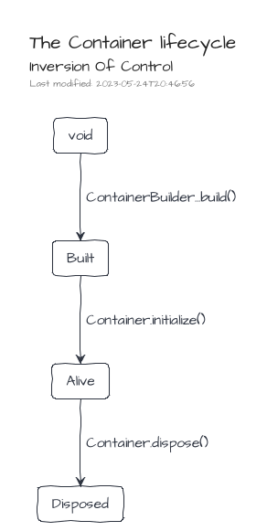
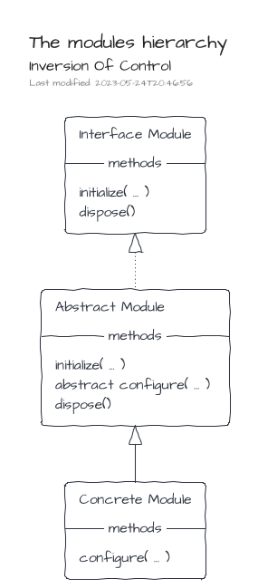
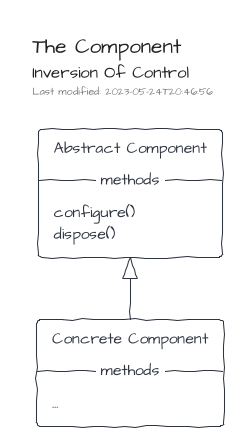

# IoC implementation

> The IOC implementation is bundled in the NPM package [@tmorin/ceb-inversion-core](https://www.npmjs.com/package/@tmorin/ceb-inversion-core).

This IoC implementation relies on three main concepts.
The first one is the _registry_.
Its purpose is to provide services to register and resolve items.
The second concept, the _module_, interacts with the registry in order to configure items to register.
Finally, the last one, the _container_, manages the lifecycle of the modules and, therefore, the lifecycle of the registry's items too.


## The Container



A Container is created using the `ContainerBuilder`, and especially its `build()` method.
Once built, the Container can be initialized, so that Modules and Components will be configured.
When a Container becomes useless, it has to be disposed, so that Modules and Components will be disposed too.
Once disposed, a container cannot be used anymore.

  ```typescript
{{#include ioc-container-lifecycle.ts}}
```

## The Registry

The Registry handles only two kinds of registration modes: _by value_ and _by factory_.

With the _by value_ mode, the value must exist at the time of the registration, and the registry will always resolve it.

  ```typescript
{{#include ioc-registry-by_value.ts}}
```

However, with the _by factory_ mode, the value is created at the resolution time.
Moreover, its creation can be based on entries available in the registry.
By default, the factory is invoked for each resolution.

  ```typescript
{{#include ioc-registry-by_factory.ts}}
```

The option `singleton` prevents this invocation of the factory at each resolution.
That means the value is created only once, at its first resolution.

  ```typescript
{{#include ioc-registry-by_factory_singleton.ts}}
```

## The Modules



A Module helps to bundle entry registrations to the registry.
It's an implementation of the interface `Module`.
However, a convenient abstracted implementation, `AbstractModule`, handles already the boilerplate stuff.

  ```typescript
{{#include ioc-container-module-class.ts}}
```

The modules are used during the creation of a container and must be provided to the ContainerBuilder.

  ```typescript
{{#include ioc-container-module-usage.ts}}
```

Sometime, the class usage can be a bit too much.
Therefore, an inline way to available using `OnlyConfigureModule.create(...)`.

  ```typescript
{{#include ioc-container-module-inline.ts}}
```

## The Components



Components follow the lifecycle of Modules, i.e. _configure_ then _dispose_.
To be discovered and managed by the Container, they must be registered with the `ComponentSymbol` Registry Key.

Components are the right places to implement Process Manager or other _reactive_ programing artifacts.

  ```typescript
{{#include ioc-container-component.ts}}
```
