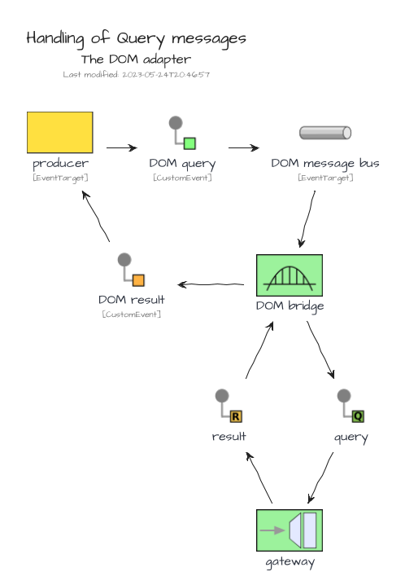
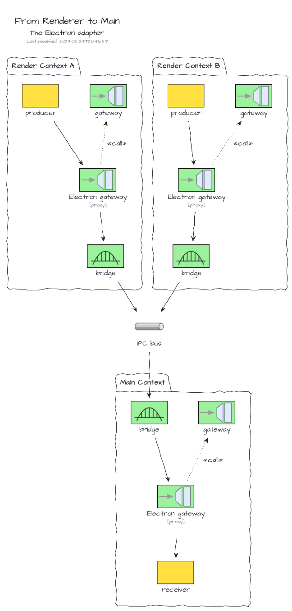
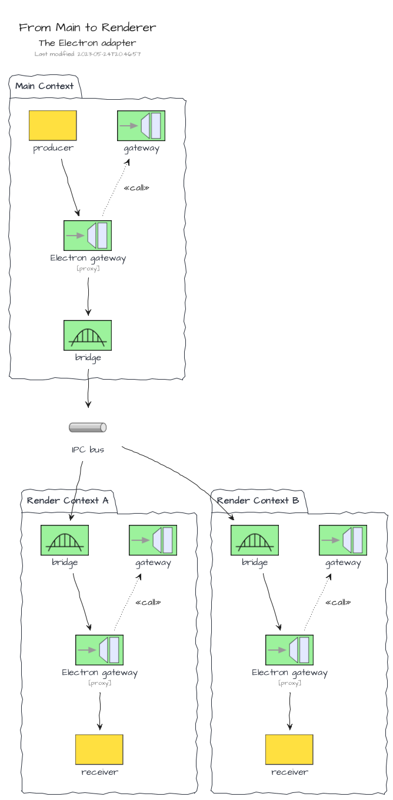

# Adapters

## The DOM Adapter

> The adapter is bundled in the NPM package [@tmorin/ceb-messaging-adapter-dom](https://www.npmjs.com/package/@tmorin/ceb-messaging-adapter-dom).

The DOM adapter provides a bridges between the DOM event handling system and a Gateway.
The main purpose is to drive the development of UI components with an Event/Message Architecture approach without dependencies or additional library.

## The Electron Adapter

> The adapter is bundled in the NPM package [@tmorin/ceb-messaging-adapter-electron](https://www.npmjs.com/package/@tmorin/ceb-messaging-adapter-electron).

The Electron adapter provides a bridges between the Electron IPC Event Emitter and a Gateway.
The main purpose is to standardize the communication flows between the _main_ context and the _renderer_ contexts based on the Location Transparency pattern.

The bridge is bidirectional for all message kinds.
However, messages dispatched from a Renderer context are only forwarded to the Main context.
That means sibling Renderer contexts won't get the messages.

However, on the other side, messages dispatched from the Main Context are forwarded to all Renderer contexts.

## The Purify Adapter

> The adapter is bundled in the NPM package [@tmorin/ceb-messaging-adapter-purify](https://www.npmjs.com/package/@tmorin/ceb-messaging-adapter-purify).

The Purify adapter provides an adapter of Gateways which integrates Purify types.
The main purpose is to provide a hint of functional programing style for the processing of commands, queries and results.

