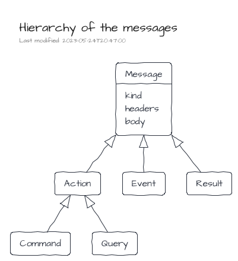
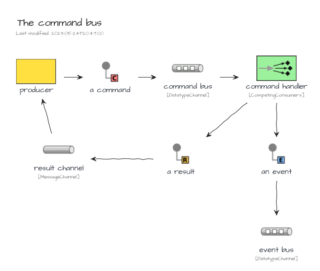
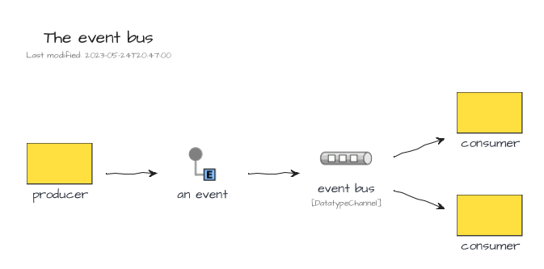
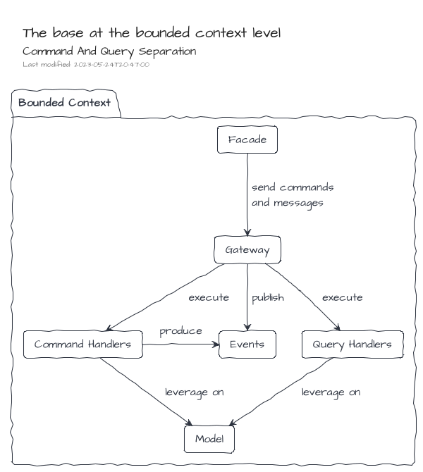
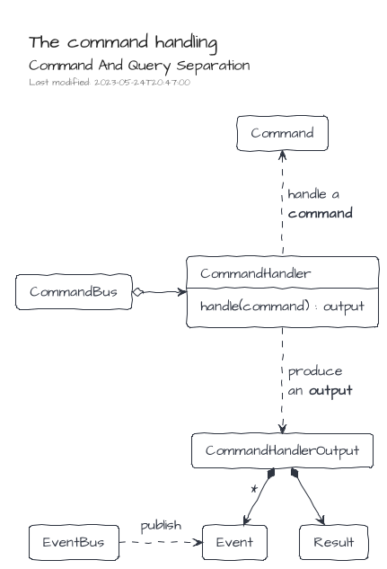
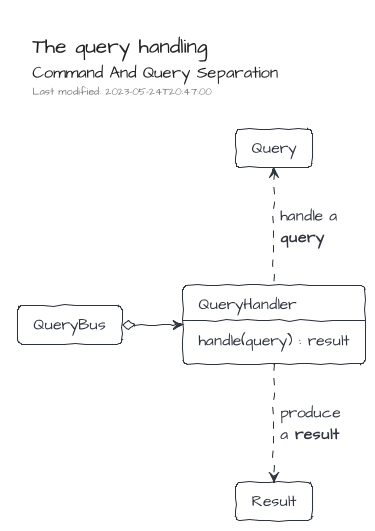
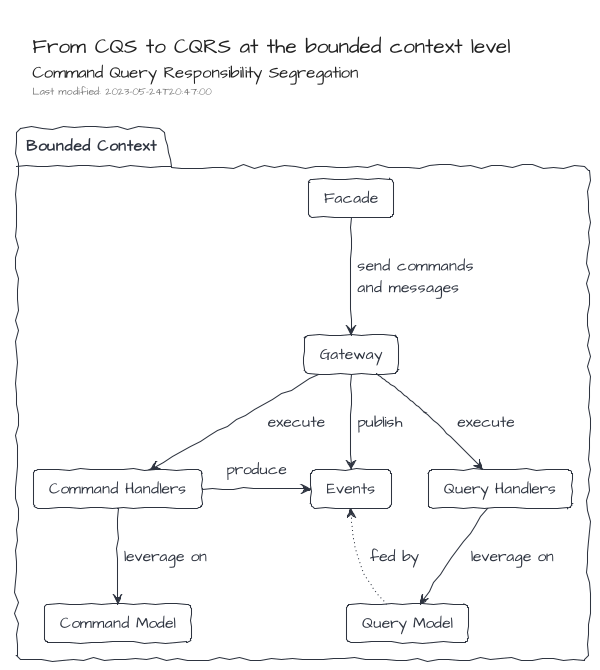
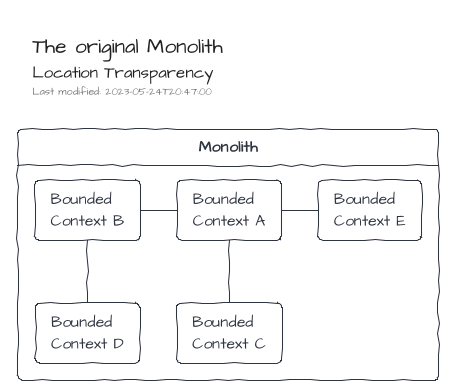
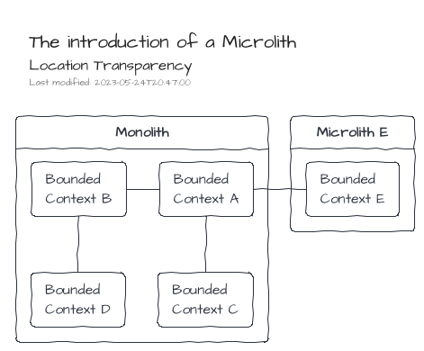

# Concepts

All Event/Message Architectures rely on common concepts.

## Messages

A message is a structured piece of information which contains a _kind_, a set of _headers_ and a _body_.

`<ceb/>` recognizes three main kinds of messages:

- A Command expresses the intent of the producer to change the state of the system.
- A Query expresses the intent of the producer to know the state of the system.
- An Event expresses that something has happened in the past.

An additional one, the Result, is used to provide a feedback to the producer within a Request-Reply scenario.

## Message Buses

A Message Bus is a component able to handle the sending and reception of messages.

The described messages are transmitted in buses from their producers to eventual receivers.

`<ceb/>` recognizes three kind of buses:

- The Command Bus dedicated for the Command messages.
- The Query Bus dedicated for the Query messages.
- The Event Bus dedicated for the Event messages.

The Command Bus and Query Bus embraces the Point-to-Point Channel characteristics.
So that, Request-Reply scenario can be implemented, especially for the Query Bus channel where the purpose is get a Result from the query handler.

On the other hand, the Event Bus relies on the Publish-Subscribe Channel characteristics.

## Gateway

From a user point of view, a gateway is an entry point to produce and consume messages.
It exposes the three message buses: the Command Bus, the Query Bus and the Event Bus.
Additionally, an Observer is also available to track some messaging side cases like error handling.

## Command And Query Separation

The CQS design pattern emphases a strict separation of the APIs about read and write operations.
At the code level, its implementation is the expressiveness of dedicated programming artifacts for each concern: wrote operations vs read operations.

On an upper level, at the Bounded Context one, the CQS design pattern can be implemented leveraging on messaging systems.

1. The Bounded Context's Facade creates and dispatches Commands and Queries to the Gateway.
2. Then, the Gateway delegates to the right handler the execution of the action.
3. Finally, the implementations of the handlers leverage on the model artifacts (Entity, Service ...) to fulfill the requests.

The logic of the command handler produces an output which is composed of two items:

- a result which will be sent back to the requester
- as well as an additional set of events which will be published on the event bus

On the other side, the logic of the query handler produces a result which will be sent back to the requester

## Command And Query Responsibility Segregation

When CQS is applied at the software architecture level, an adaptation of the command handling and query handling can be done to strictly segregate the model for the commands and the model for the queries.
There are many strategies to feed the query model based on the operations made by the command one.
One of them is to leverage on the events published by the command handling part.
The ways to feed the query model by events depends on the nature of the application.
Some can just work with transient events, whereas others may require a more robust approach based on queues or streams of events potentially persisted.

Additionally, the usage of Events can lead to a model driven by the Event Sourcing approach where the produced Event are not just a side effect of the command handling but also its source of truth.

## Location Transparency

Location Transparency is the ability to share or get resources without the knowledge of their localizations.

Because of the introduction of the messages and their underlying buses provided by the Gateway, the communication between Bounded Contexts is natively transparent.
Therefore, only infrastructural components will have to be adapted to move a Bound Context from its original Monolith to a dedicated side Microlith.

Additionally, scaling of Bounded Contexts can be done leveraging only on infrastructural components.

