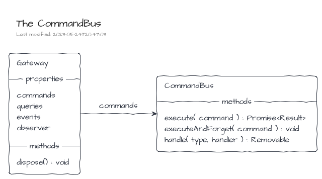
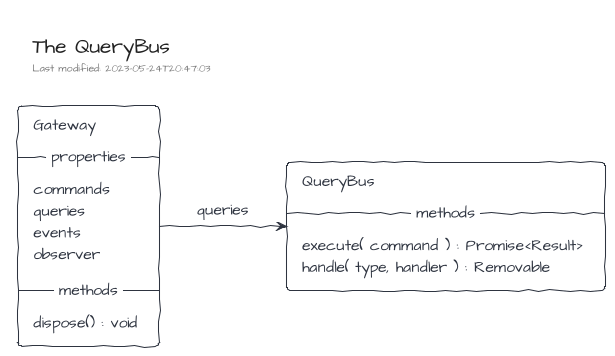

# Gateway

> The definition of the Gateway is part of the NPM package [@tmorin/ceb-messaging-core](https://www.npmjs.com/package/@tmorin/ceb-messaging-core).

The Gateway is a set of interfaces acting as an entry point to the messaging world.
It can be used to send or handle messages but also to observe the implementations' behavior.

A Gateway provides accessors to the main buses: the CommandBus, the QueryBus and the EventBus.
A remaining accessor provides an observable view point of the Gateway.

A Gateway should be ready to used once created.
Its end-of-life is triggered with its method `dispose()`.
Its purpose is to release all stateful stuff.
So that, once invoked, the Gateway cannot be used anymore.

## Commands

The CommandBus provides methods to interact with the Point-to-Point Channel which handles the commands.
The CommandBus supports the one-way or two-way conversations.

On the receiver side, the handled commands are registered using the method `handle()`.
The method expects the type of the command to handle as well as its handler.
The handler is a _callback_ function which will be invoked once a command is received.
A handler may return an output which may be composed of an optional Result and/or an optional set of Events.
If expected, the Result will be sent back to the sender.
About the set of Events, they will be published on the EventBus.
At any time, a handler can be unregistered using the Removable object returned by the method `handler()`.

On the sender side, those requiring a one-way conversation must use the method `executeAndForget()`.
Within this conversation style, the command sender doesn't expect a Result from the receiver side.
So that, the receiver and server sides don't need to handle the Request-Reply pattern.

However, senders requiring a two-way conversation must use the method `execute()`.

## Queries

The QueryBus provides methods to interact with the Point-to-Point Channel which handles the queries.
The QueryBus supports only the two-way conversations.

On the receiver side, the handled queries are registered using the method `handle()`.
At any time, a handler can be unregistered using the Removable object returned by the method `handler()`.

On the sender side, the queries are sent to the bus and the replies received using the method `execute()`.

## Events

The EventBus provides methods to interact with the Publish-Subscribe Channel which handles the events.

The publisher must use the method `publish()` to publish events.
On the other side, the subscribers must use the method `subscribe()` to subscribe on published events.
At any time, a subscription can be disposed using the Removable object returned by the method `subscribe()`.

## Observer

The Observer is a _view_ side of the Control Bus.
It provides an entry point to observe the main buses: the CommandBus, the QueryBus and the EventBus.

