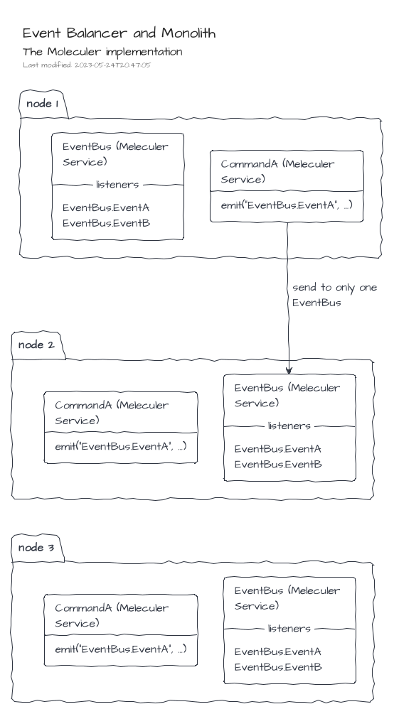
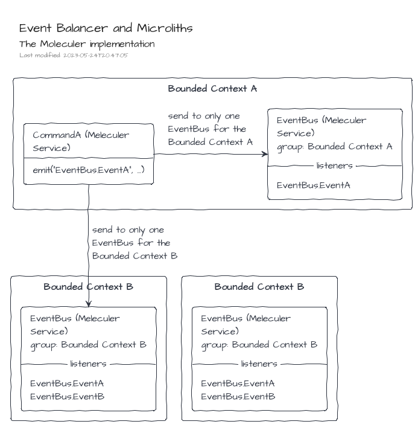

# The Moleculer implementation

> The Moleculer implementation is defined in the NPM package [@tmorin/ceb-messaging-moleculer](https://www.npmjs.com/package/@tmorin/ceb-messaging-moleculer).

The [Moleculer] implementation leverages on the features provided by the microservices framework.

## Management of Commands and Queries

There is one [Moleculer service] per command or query types.
For instance, the command type `CommandA` will be managed by the service `CommandA`.

About commands, each service provides two [Moleculer actions]: `execute` and `executeAndForget`.
The first one executes the command handler and return the result.
The second one just executes the command handler at the next clock thick.
For instance, the command type `CommandA` can be executed within the Moleculer world with the actions `CommandA.execute` and `CommandA.executeAndForget`.
Each action accepts only one parameter: the command.

About queries, each service provides only one action: `execute`.
The action executes the query handler and return the result.
For instance, the query type `QueryA` can be executed within the Moleculer world with the action `QueryA.execute`.
The action accepts only one parameter: the query.

## Management of Events

The Events are managed by a single [Moleculer service]: `EventBus`.
Each time an Event is published, the type of the [Moleculer event] is `EventBus.<MESSAGE_TYPE>`.
For instance, when the Event `EventA` is published, the Moleculer event name is `EventBus.EventA`.

By default, the implementation publish messages using the _balanced_ mode.
That means, each _balanced_ event will be processed by only one `EventBus` Moleculer service instance within the cluster.

The default mode works well for monoliths where the logic is replicated in each node of the cluster.



However, for Microliths or even Microservices, the `EventBus` instances have to arrange in logical groups.
The group name of `MoleculerEventBus` instances can be provided by constructor.



## The Inversion Module

The package provides an Inversion Module which can be used to create the MoleculerGateway instance and register it on the registry.

Create a container with the default module behavior, i.e. a ServiceBroker is expected in the registry:
```typescript
{{#include ../../packages/ceb-book-samples/src/messaging/moleculer-inversion-registrykey.ts}}
```

Create a container with a provided ServiceBroker instance.
In that case, the provided ServiceBroker will be registered in the registry.
```typescript
{{#include ../../packages/ceb-book-samples/src/messaging/moleculer-inversion-instance.ts}}
```

[Moleculer]: https://moleculer.services
[Moleculer service]: https://moleculer.services/docs/0.14/actions.html
[Moleculer actions]: https://moleculer.services/docs/0.14/actions.html
[Moleculer event]: https://moleculer.services/docs/0.14/events.html
